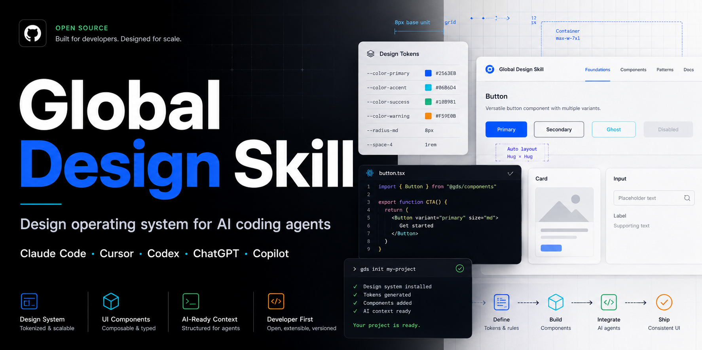
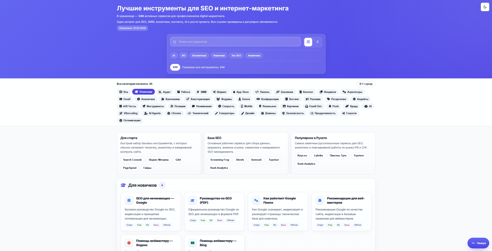
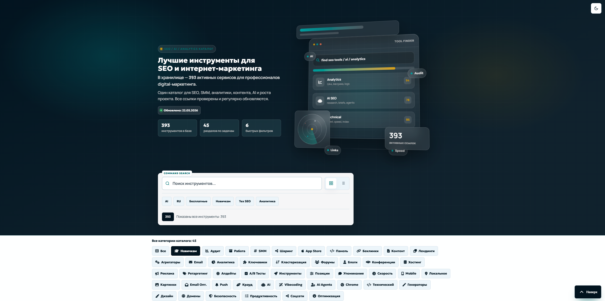
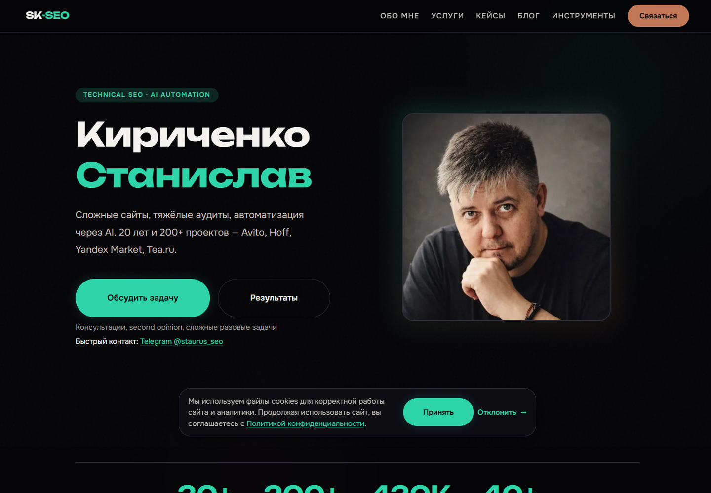
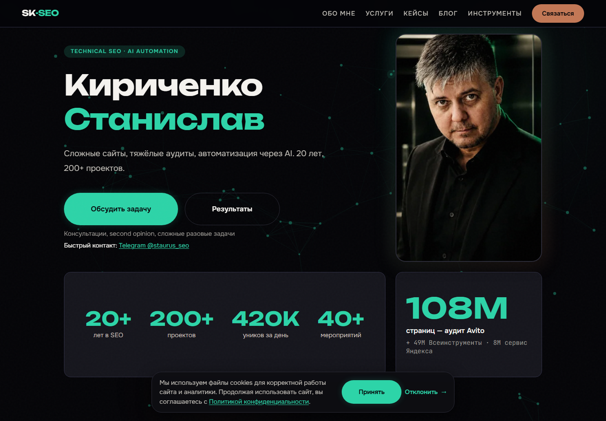
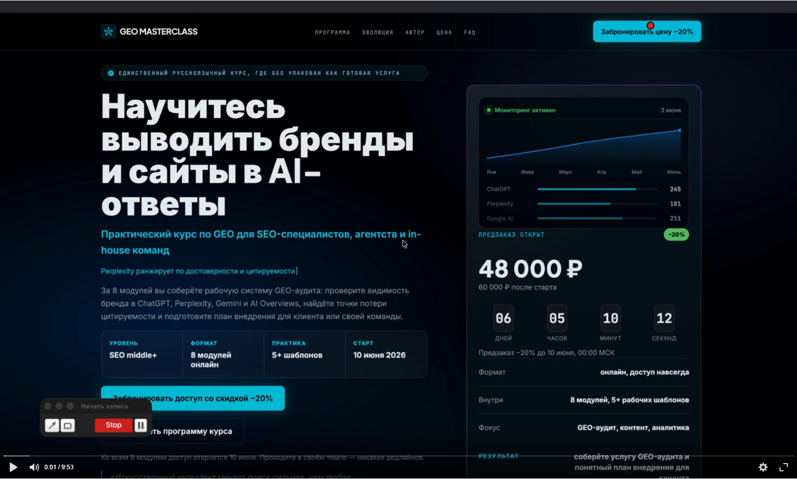
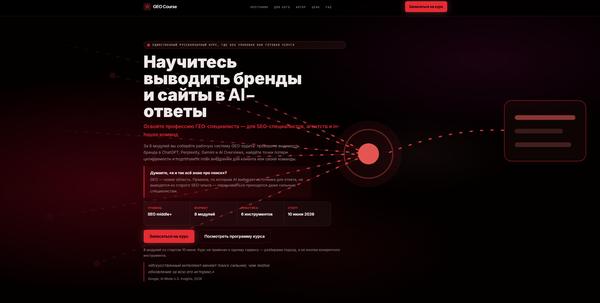

# Global Design Skill

Turn Claude Code, Cursor, Codex, ChatGPT, Windsurf, and GitHub Copilot into a stricter UI/UX design reviewer and frontend handoff assistant — one that detects your business niche, applies sector-specific rules, and improves with every project.

Not another prompt collection. A self-learning design operating system: it knows sector-specific rules for 13 industries, learns from reference sites you point it at, and calibrates its pattern weights based on your feedback. All local, no telemetry.

[](CHANGELOG.md)
[](rules/)
[](rules/)
[](rules/)
[](tokens/)
[](rules/17-motion-react.md)
[](LICENSE)

**Live demos:** https://staurus86.github.io/global-design-skill/

## Install in 30 seconds

> **A note, and an apology.** Through v2.1.0 the installer copied only `skills/global-design/`. The folders that file links to (`references/`, `rules/`, `patterns/` and the rest) live at the repo root, so they never reached your project. The anti-slop catalog and every reference link came up empty unless you happened to run from the repo root. That was my bug, and it shipped for too long. The installer now bundles those folders next to `SKILL.md`, and `gds doctor` verifies they are there. If your earlier installs felt half-broken, this is why. Sorry. Re-run the command below to get a working copy.
>
> — Staurus

```bash
git clone https://github.com/staurus86/global-design-skill.git
cd global-design-skill
python scripts/gds install --tool=all /path/to/your-project
```

### Claude Code

The `gds` command above is the recommended path — it bundles the skill's
resource folders (`references/`, `rules/`, `patterns/`, ...) beside `SKILL.md`
so its relative links resolve. Manual copy must do the same:

```bash
SRC=path/to/global-design-skill
mkdir -p .claude/skills/global-design .claude/agents
cp -r "$SRC/skills/global-design/." .claude/skills/global-design/
for d in references blueprints patterns rules checklists templates agents industries tokens integrations recipes validators; do
  cp -r "$SRC/$d" .claude/skills/global-design/
done
cp "$SRC"/agents/*.md .claude/agents/
cat "$SRC/integrations/claude-code/CLAUDE.md" >> CLAUDE.md
```

### Cursor

```bash
# Cursor 0.43+ (new format)
mkdir -p .cursor/rules
cp path/to/global-design-skill/integrations/cursor/global-design.mdc .cursor/rules/

# Cursor legacy (.cursorrules)
cp path/to/global-design-skill/integrations/cursor/cursor-rules.md .cursorrules
```

### GitHub Copilot

```bash
mkdir -p .github
cp path/to/global-design-skill/integrations/github-copilot/copilot-instructions.md .github/copilot-instructions.md
```

More install options: [install.md](install.md).

---

## Why this exists

AI coding tools can generate UI quickly, but they often ship the same generic hero sections, vague CTAs, missing states, weak mobile behavior, raw colors, inaccessible forms, and handoff gaps.

Global Design Skill gives the agent a reusable design operating system. It forces every output to answer:

- who the interface is for
- what metric it serves
- which layout, grid, states, and tokens to use
- how it works on mobile
- how accessibility is specified
- how a developer can implement it without asking follow-up questions

It also includes **SEDI (Self-Evolving Design Intelligence)**: the skill detects your business sector automatically (B2B SaaS, e-commerce, health, finance, and 10 more), applies sector-specific banned patterns and required elements, learns from reference sites you point it at, and refines its pattern weights based on revision count. The more you use it, the more accurate it becomes — and all of that stays on your machine.

## Start here

| Goal | What to use |
|---|---|
| Better landing pages | Core + Landing Pack |
| SaaS app screens | Core + SaaS Pack |
| Admin panels | Core + Admin Pack |
| Design audits (a11y, perf, conversion) | Core + Audit Pack |
| Sector-aware rules + self-learning | Core + MCP Intelligence |
| Everything | `python scripts/gds install --tool=all /path/to/your-project` |

Full pack breakdown: [docs/packs.md](docs/packs.md)

---

## Try it

Copy one of these into your AI coding assistant:

```text
Use global-design-skill and audit this landing page. Return the top 10 design problems, severity, and implementation-ready fixes.
```

```text
Use global-design-skill and redesign this SaaS hero. Avoid generic centered hero patterns. Specify layout, type scale, CTA copy, responsive behavior, and accessibility notes.
```

```text
Use global-design-skill and create a frontend handoff spec for this component. Include states, tokens, ARIA, keyboard behavior, and acceptance criteria.
```

More copy-paste prompts in [examples/prompts](examples/prompts/):
- [audit-live-url.md](examples/prompts/audit-live-url.md) — audit a live page by URL
- [build-admin-panel.md](examples/prompts/build-admin-panel.md) — build an admin panel from scratch
- [frontend-handoff-spec.md](examples/prompts/frontend-handoff-spec.md) — generate a developer handoff spec
- [improve-pricing-page.md](examples/prompts/improve-pricing-page.md) — improve an existing pricing page
- [redesign-saas-hero.md](examples/prompts/redesign-saas-hero.md) — redesign a SaaS hero section

---

## What this is

```
Global Design Skill =
  Design Principles          (rules/)
+ UX Frameworks              (blueprints/)
+ UI Patterns                (patterns/)
+ Design Tokens              (tokens/)
+ Specialized Agents         (agents/)
+ Output Templates           (templates/)
+ Review Checklists          (checklists/)
+ Improvement Recipes        (recipes/)
+ Industry Sector Rules      (industries/)   ← 13 sectors, niche auto-detected
+ Self-Learning Engine       (learning/)     ← learns from sites you point it at
+ SEDI                       (sedi/)         ← adapts to your feedback over time
```

**Not:** "make it look nice."
**Yes:** what to build, for whom, why, which grid, which states, how to hand it off — and a skill that gets more accurate the more you use it.

---

## Capabilities

| Task | How to invoke |
|---|---|
| Build a landing page from scratch | "Use global-design-skill and create a landing page for [product]" |
| Build a SaaS app | "Use global-design-skill and scaffold a SaaS app shell for [product]" |
| Build an admin panel | "Use global-design-skill and architect an admin panel for [product]" |
| Build a pricing page | "Use global-design-skill and create a pricing page for [product]" |
| Build a portfolio | "Use global-design-skill and create a developer portfolio for [name]" |
| Build an onboarding flow | "Use global-design-skill and design a user onboarding flow" |
| Design a dashboard | "Use global-design-skill and build a dashboard for [app]" |
| Run a design audit | "Use global-design-skill and audit this page: [HTML/screenshot/URL]" |
| Find design references | "Use global-design-skill reference-hunter to find hero examples for [context]" |
| Competitive analysis | "Use global-design-skill reference-hunter to compare [site1], [site2], [site3]" |
| Audit a live URL | "Use global-design-skill reference-hunter to audit [URL]" |
| Write a frontend spec | "Use global-design-skill and write a frontend ТЗ for [component]" |
| Improve a hero section | "Use global-design-skill and improve this hero section" |
| Improve navigation | "Use global-design-skill and improve the navigation" |
| Improve typography | "Use global-design-skill and improve the typography" |
| Add animations | "Use global-design-skill and add animations to this page" |
| Fix loading states | "Use global-design-skill and improve the loading states" |
| Add dark mode | "Use global-design-skill and add dark mode to this project" |
| Add wow effects | "Use global-design-skill and add visual effects to this hero" |
| Add parallax | "Use global-design-skill and add parallax to this page" |
| Add page transitions | "Use global-design-skill and add page transitions" |
| Add hover effects | "Use global-design-skill and add hover effects to the cards" |
| Add text animations | "Use global-design-skill and animate the hero text" |
| Review before shipping | "Use global-design-skill and run a UI review checklist" |
| Lock a multi-page design system (MASTER) | "Use global-design-skill and create a design-system MASTER for this site, then page overrides" |
| Verify the rendered result in every mode | "Use global-design-skill and verify this page renders correctly across themes, viewports, and states" |
| WCAG accessibility audit | "Use global-design-skill accessibility-auditor on this component" |
| Performance audit | "Use global-design-skill performance-auditor on this page" |
| Detect business niche automatically | "Use global-design-skill and design for [product/context]" — niche auto-detected |
| Get sector-specific design rules | "Use global-design-skill and get rules for [sector]" |
| Learn from reference sites | "Use global-design-skill MCP: learn_from_reference [url]" |
| Query pattern weights and feedback | "Use global-design-skill MCP: list_learned_niches" |

---

## Worked Examples

| Example | What it demonstrates |
|---|---|
| [Hero redesign](examples/01-hero-redesign.md) | Generic hero → clearer hierarchy, better CTA, stronger visual system |
| [Color token migration](examples/02-color-token-migration.md) | Hardcoded color cleanup with OKLCH tokens |
| [Form accessibility](examples/03-form-accessibility.md) | Labels, errors, focus states, ARIA, and keyboard behavior |
| [Card grid cleanup](examples/04-card-grid-cleanup.md) | Flat equal cards → stronger editorial rhythm |
| [Performance audit](examples/05-performance-audit.md) | LCP/CLS/INP issues translated into fixes |
| [Dark mode implementation](examples/06-dark-mode-implementation.md) | Token layer and theme switch strategy |
| [Landing page audit](examples/audits/01-landing-page-audit.md) | Full page review with gate-based scoring |
| [SaaS hero redesign](examples/landing-pages/01-saas-hero-redesign.md) | Landing page rewrite with implementation notes |
| [Skill walkthroughs — 5 site types](examples/skill-walkthroughs.md) | Dry-run routing: fintech SaaS · travel landing · e-commerce catalog redesign · unknown-niche learn · healthcare audit |
| [bestseotools case study (before → after)](redesigns/bestseotools/CASE-STUDY.md) | Real multi-pass catalog redesign, 65–70% → ~85%, with screenshots |
| [sk-seo.ru a11y + contrast + anti-slop audit (before → after)](examples/before-after/sk-seo-2026-05-30/README.md) | 28-page audit: WCAG contrast fixes (ghost decoratives lifted to readable), forced-colors focus, form ARIA — 0 axe across 13 pages |
| [sk-seo.ru bento redesign (before → after)](examples/before-after/sk-seo-2026-05-31/README.md) | Live 7-page redesign: bento proof-blocks, 60-icon branded set, portraits, unified blog CTAs — 0 axe / 0 overflow, shipped |
| [GEO course landing (before → after)](examples/before-after/geo-course-2026-06-06/README.md) | Dark course LP: teal dashboard-card-and-countdown hero → crimson "answer-graph" metaphor hero, dark pattern removed, editorial hierarchy |

---

## Real-World Result

Tested on a live Russian SEO tools directory (450 tools, real production traffic), over several passes. Initial prompt: **"сделай дизайн лучше"** ("make the design better").

| Before | After |
|--------|-------|
|  |  |

**What changed:**
- Generic "best SEO tools" hero → an author-framed hero ("the tools in my working stack") with a curator chip and real result tiles
- No selection path → JTBD scenarios ("what do you need?") + curated "ready stacks" shelves on top of the 450-item base
- One ambiguous `$` symbol → explicit **Free / Freemium / Paid** badges + **★ my stack**
- Flat 45-item category row → grouped category nav, a tool-radar with legend, plus favorites / CSV-Markdown export / share
- Cleaned the semantic layer too: decorative numbers `aria-hidden`, no stray glyphs in `innerText`, real static count fallbacks

Full before → after: [`redesigns/bestseotools/CASE-STUDY.md`](redesigns/bestseotools/CASE-STUDY.md).

### Second case — sk-seo.ru (live, 7 pages, shipped 2026-05-31)

A second pass on a different live site (personal brand, dark theme, vanilla HTML/CSS/JS, no build step). This one was a **visual upgrade**, not just cleanup: a bento "proof-block" language, a 60-icon branded set, real portraits, and a unified blog CTA — verified at **0 axe violations / 0 horizontal overflow** on 390/768/1280/1440 across 9 pages, then deployed and smoke-tested on production.

| Before (home) | After (home) |
|--------|-------|
|  |  |

**What changed:**
- Flat 2-column hero with proof numbers below the fold → **bento hero** with an accent "proof" cell (`108M — biggest audit`) and the credibility numbers above the fold
- Uniform service grid → a **spotlight** featured-tariff (price-anchor) + trust strip; **branded topic icons** replace generic line icons
- Case cards gained an **editorial meta-spec** (Niche / Scale / Status) where "Scale" is a *tier*, not a repeat of the headline number
- Generic Lucide icons → a **60-icon branded set**, one-topic-one-icon, applied to blog (15) + services (6) + tools (30)
- 12 blog articles that ended with no CTA → a unified inline + final CTA

Full before → after: [`examples/before-after/sk-seo-2026-05-31/`](examples/before-after/sk-seo-2026-05-31/README.md) (before/ + after/ + 12 component shots + `DESIGN-DECISIONS.md`).

### Earlier pass — readability & contrast on the dark theme

Before the bento work, the same site went through an a11y + contrast pass with the skill ([`examples/before-after/sk-seo-2026-05-30/`](examples/before-after/sk-seo-2026-05-30/README.md)). The dark theme leaned on **ghost decoratives** — accent-green numbers and a giant "404" set at `opacity: 0.15–0.3`. On a near-black background those shimmer and strain the eye, and they measured **1.2–1.9:1** (axe color-contrast failures). They were lifted to `opacity: 0.5–0.6` (≈readable), card tags moved `--text-muted → --text-secondary`, and the body text stays a softened off-white (`#f5f3ef`), never pure white — the dark-mode contrast ceiling. Result: **0 axe color-contrast failures across 13 pages**, and the page reads calm instead of vibrating.

This is encoded in [`rules/19-contrast-standards.md`](rules/19-contrast-standards.md) (WCAG AA/AAA + APCA + dark-mode ceiling) and the **ghost-decorative anti-pattern** (low-opacity accent text holds legibility only at ~`opacity ≥ 0.55`).

### Third case — GEO course landing (geo-course.ru)

A dark course landing whose hero leaned on the two things the skill bans first: a decorative dashboard card (a bar chart with no real data) and a countdown timer (fake urgency). The redesign replaced both with a single idea.

| Before | After |
|--------|-------|
|  |  |

**What changed:**
- Teal-on-near-black (the default "dark SaaS" accent) → a **single crimson hue** with one signature radial glow — one color story, not a teal card fighting a teal CTA
- The decorative **dashboard card** → a **visual metaphor**: a glowing central node with radiating network lines (the *answer graph* — your brand as the node AI engines cite), the page's One Memorable Thing
- The `06 : 05 : 10 : 12` **countdown timer removed** — a banned dark pattern; urgency now reads from a dated cohort, not a ticking clock
- `48 000 ₽` + timer → a **course-substance strip** (level · modules · tools · start date), value over price pressure
- Centered text + floating card → **editorial hierarchy**: larger tight display H1, eyebrow pill, a framing question block, and a real attributed testimonial (E-E-A-T over decoration)
- Two competing buttons → one **red primary CTA** + a quiet secondary text link

Full before → after: [`examples/before-after/geo-course-2026-06-06/`](examples/before-after/geo-course-2026-06-06/README.md).

---

## Best For

- AI-assisted frontend teams that want fewer generic layouts
- Claude Code, Cursor, Codex, Windsurf, ChatGPT, and Copilot users
- solo builders who need UI critique before shipping
- agencies turning rough ideas into frontend handoff specs
- product teams standardizing AI-generated UI output
- design engineers who want reusable gates, tokens, and review checklists
- teams building in niche industries that generic design rules don't cover well
- anyone who wants a design system that gets smarter the more they use it

---

## Repository Structure

```
global-design-skill/
│
├── skills/global-design/           ← Core skill — start here
│   ├── SKILL.md                    ← Main AI entry point
│   ├── task-routing.md             ← "If task is X, use files Y"
│   ├── operating-principles.md     ← Design decision framework
│   ├── output-formats.md           ← Output format per audience
│   └── quality-gates.md            ← 8 acceptance gates
│
├── agents/                         ← 11 specialized review agents
│   ├── design-director.md          ← Visual maturity, brand alignment
│   ├── ux-architect.md             ← User flows, IA, edge cases
│   ├── conversion-designer.md      ← CTAs, pricing, friction
│   ├── design-critic.md            ← Adversarial — finds banned patterns
│   ├── frontend-handoff-reviewer.md ← Gate 8: implementation-ready?
│   ├── accessibility-auditor.md    ← 4-phase WCAG audit, severity matrix
│   ├── performance-auditor.md      ← CWV investigation, LCP/CLS/INP
│   ├── copy-editor.md              ← Headline test, CTAs, banned words
│   ├── motion-designer.md          ← Easing audit, duration, reduced-motion
│   ├── design-systems-auditor.md   ← Token coverage, debt scoring 0–100
│   └── reference-hunter.md         ← Find/score real examples, audit URLs
│
├── blueprints/                     ← Build-from-scratch protocols
│   ├── landing-page-from-scratch.md ← 9-section AIDA landing page
│   ├── interactive-landing-page.md ← Full wow stack: grain+mesh+effects
│   ├── saas-app-from-scratch.md    ← 3 shell options, 6 core screens
│   ├── admin-panel-from-scratch.md ← Density-first, 6 screens
│   ├── website-from-scratch.md     ← Multi-page IA, nav, schema
│   ├── redesign-existing-page.md   ← 6-phase redesign protocol
│   ├── pricing-page-from-scratch.md ← Hero+toggle, 3 tiers, FAQ, trust
│   ├── portfolio-from-scratch.md   ← Work grid, about, contact, anti-patterns
│   ├── onboarding-flow-from-scratch.md ← Signup → aha moment → checklist
│   └── ecommerce-from-scratch.md   ← PLP, PDP buy box, cart, 12-element checkout
│
├── rules/                          ← 22 rules files (00–21)
│   ├── 00-escalation-protocol.md   ← Intent-to-depth mapping (read first)
│   ├── 01-visual-hierarchy.md      ├── 09-responsive.md
│   ├── 02-layout-and-grid.md       ├── 10-forms.md
│   ├── 03-typography.md            ├── 11-data-tables.md
│   ├── 04-color.md                 ├── 12-admin-panels.md
│   ├── 05-animation.md             ├── 13-saas-products.md
│   ├── 06-components.md            ├── 14-landing-pages.md
│   ├── 07-accessibility.md         ├── 15-iconography.md
│   ├── 08-performance.md           ├── 16-design-for-seo.md
│   ├── 17-motion-react.md          ← motion/react v12 (scroll, stagger, exit)
│   ├── 18-css-framework-selection.md ← Bootstrap / Bulma / UnoCSS / Panda CSS / Open Props router
│   ├── 19-contrast-standards.md   ← WCAG AA/AAA, APCA, surface stacking, dark mode ceiling, fix workflow
│   ├── 20-rendered-verification.md ← render → audit → fix loop, mode matrix, verify-before-done
│   └── 21-one-shot-build.md        ← single-prompt autonomous build: assume → build → self-verify
│
├── patterns/
│   ├── marketing-blocks/           ← 9 landing page section files
│   │   ├── hero-sections.md        ├── feature-sections.md
│   │   ├── pricing-sections.md     ├── comparison-sections.md
│   │   ├── social-proof.md         ├── stats-sections.md
│   │   ├── cta-sections.md         └── bento-grid.md
│   │   └── faq-sections.md
│   │
│   ├── product-ui/                 ← 13 SaaS / app UI files
│   │   ├── onboarding.md           ├── forms.md
│   │   ├── empty-states.md         ├── modals.md
│   │   ├── error-states.md         ├── notifications.md
│   │   ├── loading-states.md       ├── search.md
│   │   ├── settings-pages.md       ├── tooltips-popovers.md
│   │   ├── command-palette.md      ├── microinteractions.md
│   │   └── auth-screens.md         ← sign-up, reset, magic link, OTP/2FA
│   │
│   ├── navigation/                 ← 6 navigation pattern files
│   │   ├── header-patterns.md      ├── tabs-patterns.md
│   │   ├── sidebar-patterns.md     ├── breadcrumbs.md
│   │   └── mobile-navigation.md    └── pagination.md
│   │
│   ├── admin-ui/                   ← 5 admin / data-heavy files
│   │   ├── data-tables.md          ├── charts.md
│   │   ├── filters.md              └── bulk-actions.md
│   │   └── dashboard-layouts.md
│   │
│   └── effects/                    ← 7 visual effects files
│       ├── visual-effects.md       ← Grain, mesh gradient, spotlight, glow, glass, aurora
│       ├── parallax-system.md      ← 6 levels: CSS / JS / mouse / GSAP / scroll-driven
│       ├── text-animations.md      ← Split reveal, blur-in, scramble, typewriter, marquee
│       ├── scroll-experiences.md   ← Lenis, pinned cards, h-scroll, progress bar, snap
│       ├── hover-effects.md        ← 3D tilt, magnetic btn, fill slide, image hover, pill nav
│       ├── cursor-effects.md       ← Glow, custom dot, invert, text-reveal, trail
│       └── 3d-effects.md           ← CSS 3D, card flip, product tilt, Three.js, Spline
│
├── references/                     ← 28 reference files: knowledge + examples
│   ├── typography.md               ← Variable fonts, fluid scale, pairing, loading
│   ├── color-alchemy.md            ← OKLCH color science, palette construction
│   ├── motion-systems.md           ← CSS-native motion, easing/duration tokens, springs
│   ├── gsap-patterns.md            ← Timeline, ScrollTrigger, SplitText, 5 known traps
│   ├── motion-dev.md               ← Motion React API (hooks, scroll, variants)
│   ├── visual-effects.md           ← Visual effects code catalog
│   ├── 3d-animations.md            ← 3D / WebGL / react-three-fiber
│   ├── accessibility.md            ← ARIA, focus, keyboard reference
│   ├── performance.md              ← CWV, images, fonts, bundle reference
│   ├── tokens.md                   ← Spacing, shadow, radius token reference
│   ├── forms.md                    ← Form states, validation, components
│   ├── responsive.md               ← Breakpoints, container queries
│   ├── data-viz.md                 ← Charts, tables, KPI reference
│   ├── inspiration-sites.md        ← 8-category site gallery (galleries, SaaS, portfolios...)
│   ├── aesthetic-archetypes.md     ← Real sites per archetype A–H with annotations
│   ├── aesthetic-recipes.md        ← Named-look composition layer + a11y guardrails (glass/aurora/OLED/brutalist)
│   ├── saas-ui-examples.md         ← Annotated SaaS UI patterns (empty states, onboarding...)
│   ├── marketing-sites.md          ← Hero/social proof/features/CTAs in production
│   ├── portfolios.md               ← 8 annotated portfolio sites with thesis analysis
│   ├── pricing-pages.md            ← Linear/Vercel/Stripe/Notion pricing analyzed
│   ├── navigation-examples.md      ← Sidebar/top nav/mobile/breadcrumbs in the wild
│   ├── behavioral-design.md        ← 29 cognitive biases mapped to UI decisions (pricing, CTAs, nav, trust, onboarding)
│   ├── tech-standards.md           ← Full stack snippets: CSS/Tailwind/React/Next/Motion/GSAP
│   ├── sources.md                  ← Authoritative primary sources (WCAG, CWV, OKLCH, Baseline, Laws of UX...)
│   ├── component-libraries.md      ← Copyable libraries + templates + assets, with licensing
│   ├── live-audit-snippets.md      ← Browser-console audits: contrast, invisible text, badge overlap, state exercise
│   └── catalog-and-directory-design.md ← Generative anti-slop for catalogs: metaphor, JTBD scenarios, card differentiation, curation
│
├── tokens/                         ← Design token system
│   ├── design-tokens.json          ← W3C DTCG format (Style Dictionary ready)
│   ├── tokens.css                  ← CSS custom properties — light mode
│   ├── tokens-dark.css             ← Dark mode overrides
│   └── README.md                   ← Usage guide + tooling integration
│
├── templates/
│   ├── specs/
│   │   ├── frontend-tz.md          ← Gate 8 developer handoff template
│   │   ├── component-spec.md       ← Component API + states + ARIA template
│   │   ├── design-review-report.md ← Review output with gates + scores + sign-off
│   │   └── design-system-master.md ← Multi-page source of truth + page-overrides convention
│   ├── briefs/
│   │   ├── project-brief.md        ← Problem → goal → scope → sign-off
│   │   └── redesign-brief.md       ← Redesign scope, constraints, acceptance criteria
│   └── outputs/
│       └── ux-audit-report.md      ← UX audit deliverable template
│
├── checklists/
│   ├── global-design-review.md     ← 100+ checks, 11 sections, banned patterns
│   ├── landing-conversion-review.md ← AIDA, CTA, social proof, friction, SEO
│   ├── ui-review.md                ← Forms, tables, modals, loading, errors, a11y
│   ├── frontend-handoff-review.md  ← Gate 8 extended handoff checklist
│   ├── admin-panel-review.md       ← Density, tables, destructive actions, states
│   └── wow-effects-checklist.md    ← 65 checks: reduced-motion, GPU, mobile, banned
│
├── recipes/                        ← 16 step-by-step improvement guides
│   ├── make-page-more-premium.md   ├── improve-typography.md
│   ├── make-interface-cleaner.md   ├── add-animations.md
│   ├── improve-hero-section.md     ├── improve-loading-states.md
│   ├── improve-pricing-page.md     ├── improve-onboarding.md
│   ├── improve-forms.md            ├── create-wow-hero.md
│   ├── add-dark-mode.md            └── add-page-transitions.md
│   ├── improve-mobile-version.md
│   ├── improve-empty-states.md
│   ├── improve-navigation.md
│   └── extract-design-from-reference.md ← reference (image/site/Figma) → filled MASTER + DTCG tokens
│
├── examples/                       ← Before/after worked examples
│   ├── 01-hero-redesign.md         ← Font, gradient, CTA fixes
│   ├── 02-color-token-migration.md ← Hardcoded hex → OKLCH tokens
│   ├── 03-form-accessibility.md    ← 8 a11y fixes
│   ├── 04-card-grid-cleanup.md     ← Equal grid → asymmetric bento
│   ├── 05-performance-audit.md     ← LCP 4.2s → 1.8s
│   ├── 06-dark-mode-implementation.md ← Token layer + toggle
│   ├── landing-pages/
│   │   └── 01-saas-hero-redesign.md  ← Banned hero → editorial split
│   ├── apps/
│   │   └── 01-settings-page.md      ← Flat form → vertical tab nav
│   ├── audits/
│   │   └── 01-landing-page-audit.md  ← Full audit: 34/100 → all gates + fixes
│   └── websites/
│       ├── 01-multi-page-site.md    ← Multi-page IA, nav system, schema, CSS Anchor
│       └── 02-agency-portfolio.md   ← Cyberbrutalism studio: scramble, view-transitions
│
├── industries/                 ← 13 sector-specific design rule files
│   └── _index.md, b2b-products.md … entertainment.md
│
├── patterns/states/            ← 5 extended UI state files + decision matrix
│
├── validators/                 ← Lighthouse CI, axe-core, bundle-analyzer guides
│
├── feedback/                   ← Gate-8 tracker and iteration log templates
│
├── mcp-server/                 ← Python MCP server: 11 tools, 0 database
│   ├── server.py
│   ├── tools/
│   └── tests/
│
├── learning/                   ← Phase 3 learning engine (ethical scraper + KB)
│
├── sedi/                       ← Phase 4 SEDI: perception → cognition → execution
│   │                             → feedback → evolution
│   └── local_store/            ← ~/.global-design-skill/ (local only, no telemetry)
│
├── integrations/                   ← 16 AI tool + framework configuration files
│   ├── frameworks/                 ← CSS framework profiles (5 frameworks)
│   │   ├── bootstrap/profile.md   ← Bootstrap 5.3 OKLCH adaptation
│   │   ├── bulma/profile.md       ← Bulma 1.0 CSS-only
│   │   ├── open-props/profile.md  ← Token layer, any stack
│   │   ├── unocss/profile.md      ← Tailwind-compatible atomic CSS
│   │   └── panda-css/profile.md   ← Type-safe React/Next.js
│   ├── claude-code/CLAUDE.md       ← Paste-ready CLAUDE.md snippet
│   ├── cursor/cursor-rules.md      ← .cursorrules content (legacy)
│   ├── cursor/global-design.mdc    ← .cursor/rules/ content (Cursor 0.43+)
│   ├── chatgpt/custom-gpt-instructions.md ← GPT system prompt
│   ├── windsurf/rules.md           ← .windsurfrules content
│   ├── github-copilot/copilot-instructions.md ← Copilot Chat rules
│   ├── 21st-dev/guide.md           ← Component library workflow + token adaptation
│   ├── hyperframes/guide.md        ← HTML design → MP4 video (product demo, social, changelog)
│   └── figma/
│       ├── variables-export-guide.md  ← Primitives + semantic + Style Dictionary
│       ├── plugin-workflow.md         ← Tokens Studio + handoff gate
│       └── figma-handoff-checklist.md ← Naming conventions + handoff protocol
│
├── README.md                       ← This file
├── CONTRIBUTING.md                 ← Contribution standards
├── CHANGELOG.md                    ← Version history
└── install.md                      ← Setup per tool
```

---

## Technology Standards (2026 Baseline)

| Area | Standard |
|---|---|
| **CSS** | Nesting, `:has()`, `@property`, `@starting-style`, Popover API, Anchor Positioning, Scroll-driven Animations, View Transitions Level 2 |
| **CSS 2026** | `sibling-index()` / `sibling-count()` stagger, `@container scroll-state()` sticky/scroll, `text-box` baseline trim, typed `attr()` token bridging |
| **Colors** | OKLCH throughout — `oklch(65% 0.22 258)` not hex |
| **CSS Frameworks** | Tailwind v4 (default), Bootstrap 5.3, Bulma 1.0, UnoCSS, Panda CSS, Open Props — auto-detected from `package.json` |
| **Tailwind** | v4 — `@theme {}` in CSS, no `tailwind.config.js` |
| **React** | 19 — `useActionState`, `useOptimistic`, `useFormStatus`, ref as prop |
| **Next.js** | 16 — Turbopack (default), `await cookies()`, `"use cache"` + Cache Components (PPR), `proxy.ts` |
| **Motion** | `motion/react` v12 — `whileInView`, `useScroll`, `AnimatePresence`, `useReducedMotion`, OKLCH color support |
| **GSAP** | `useGSAP` from `@gsap/react`, `contextSafe()` |
| **TypeScript** | 5.x — `satisfies`, `const` type params, template literal types |
| **Accessibility** | WCAG 2.2 AA — 4.5:1 contrast, 44px touch targets, focus-visible — full contrast standards in `rules/19-contrast-standards.md` |

---

## Design System

All colors use **OKLCH** for perceptual uniformity. All spacing sits on a **4px grid**. Display type uses **`clamp()`** where a real viewport range is needed; compact UI text uses fixed token sizes.

```css
/* tokens/tokens.css — import in your project */
--color-accent:  oklch(57% 0.22 258);          /* electric blue */
--color-surface: oklch(100% 0.002 258);        /* card background */
--text-hero:     clamp(3.5rem, 8vw + 1rem, 12rem);
--space-6:       24px;                          /* 4px × 6 */
--radius-xl:     16px;
--ease-spring:   cubic-bezier(0.16, 1, 0.3, 1);
```

Dark mode: import `tokens-dark.css` and add `data-theme="dark"` to `<html>`. See `recipes/add-dark-mode.md`.

---

## Agents

Eleven specialized agents for different phases and domains:

| Agent | Runs when | Verdict format |
|---|---|---|
| `ux-architect` | Problem definition phase | Gates checklist |
| `design-director` | After concept is presented | Table: area / problem / severity |
| `conversion-designer` | Landing pages, pricing, onboarding | Friction inventory |
| `design-critic` | After design-director | REJECTED / CONDITIONAL / APPROVED |
| `frontend-handoff-reviewer` | Before dev handoff | Pass/fail per Gate 8 criterion |
| `accessibility-auditor` | WCAG review, pre-ship | Severity matrix (critical/major/minor) |
| `performance-auditor` | CWV issues, slow pages | CWV dashboard + action list |
| `copy-editor` | Any user-facing text | Headline test + rewrite examples |
| `motion-designer` | Animation audit, flat pages | PASS / REVISE / BLOCKED |
| `design-systems-auditor` | Token migration, consistency | Debt score 0–100 + migration path |
| `reference-hunter` | Find examples, audit URLs, competitive analysis | Annotated examples + scores |

---

## MCP Server

The optional MCP server exposes design intelligence as **tools**, **resources**, and **prompts** callable from Claude Code, Cursor, and Windsurf:

```bash
cd mcp-server
pip install -e ".[test]"
python server.py                     # full mode
GDS_MCP_SAFE_MODE=1 python server.py # static tools only, no HTTP requests
```

**11 tools across 4 layers:**

| Tool | Layer | Description |
|---|---|---|
| `list_sectors` | Static | All 13 sectors with descriptions |
| `classify_niche` | Static | Detect sector from a text query |
| `get_sector_context` | Static | Full rules from industries/*.md |
| `check_banned_patterns` | Static | Flag banned patterns in a design |
| `get_quick_diagnosis` | Static | 5-question sector + pattern detection |
| `learn_from_reference` | Learning | Scrape a site and extract patterns |
| `get_or_learn_sector` | Learning | Get static + learned context combined |
| `list_learned_niches` | Learning | Show all locally-learned niches |
| `forget_niche` | Learning | Delete a niche from local KB |
| `resolve_suspicion` | SEDI | Resolve static/learned conflicts |
| `reset_weights` | SEDI | Reset pattern weights to 1.0 (sector or global) |

**Resources** (11 dynamic URI patterns — agents can pull repository files directly):

```
gds://rules/{name}
gds://industries/{sector}
gds://blueprints/{name}
gds://patterns/{category}/{name}
gds://tokens/css
gds://tokens/css-dark
gds://templates/frontend-tz
gds://templates/component-spec
gds://checklists/global-design-review
gds://checklists/landing-conversion-review
gds://skills/global-design
```

**5 prompts** (pre-built workflows): `audit_landing_page`, `redesign_hero`, `create_frontend_handoff`, `improve_admin_table`, `sector_design_brief`

See `mcp-server/README.md` for full setup. See `PRIVACY.md` for data handling and `SECURITY.md` for the safe-mode flag.

---

## How it learns (SEDI)

Global Design Skill includes **SEDI (Self-Evolving Design Intelligence)** — a 6-layer pipeline that makes the skill adapt to your work instead of staying static.

```
Request → Perception → Cognition → Execution → Feedback → Evolution
```

**Perception** — detects the business sector (B2B SaaS, e-commerce, health, finance...), sub-niche, intent (create / improve / audit), and constraints from your request.

**Cognition** — selects design rules using a 4-level priority resolver: your explicit overrides win first, then validated learned patterns, then static sector rules, then generic design principles.

**Execution** — generates design output with a source citation per rule applied, so every decision is traceable.

**Feedback Engine** — tracks explicit ratings (1–5) and implicit signals (revision count). Pattern weights adjust ±10% per interaction, bounded between 0.1× and 2.0×. After 5+ interactions the skill self-calibrates.

**Learning Engine** — when a niche isn't in the 13 built-in sectors, the skill scrapes reference sites you provide (robots.txt-compliant, 10 req/min), extracts layout/trust/conversion patterns, and saves them to a local knowledge base.

**Evolution** — a weekly cycle detects stale niches, captures accuracy baselines, and logs all changes to `~/.global-design-skill/evolution_log/`.

All learning is **local, private, and reversible**. Use `forget_niche` or `reset_weights` via the MCP server to clear any learned state.

---

## Key Patterns at a Glance

**Landing page structure:** `blueprints/landing-page-from-scratch.md`
→ Hero → Social proof bar → Problem → How it works → Features → Deep proof → Pricing → FAQ → Final CTA

**Admin panel core screens:** `blueprints/admin-panel-from-scratch.md`
→ Data table → Detail/Edit → Create/Form → User management → Audit log → Settings

**SaaS empty state formula:** `patterns/product-ui/empty-states.md`
→ Preview image → "[Feature] will appear here" → Why valuable → "Create your first [noun]"

**Error message formula:** `patterns/product-ui/error-states.md`
→ `[What failed] — [Why] — [How to fix]`

**CTA label formula:** `rules/14-landing-pages.md`
→ `Verb + Object + Context` — "Start Pro free for 14 days"

**Wow effects stack:** `blueprints/interactive-landing-page.md`
→ Grain texture → Mesh gradient → Spotlight cursor → Entrance sequence → Scroll reveals → 3D tilt → View Transitions

---

## Quality Gates

A design passes handoff when it clears all 8 gates:

```
Gate 1 — Problem Definition
Gate 2 — Information Architecture
Gate 3 — Design System
Gate 4 — States
Gate 5 — Responsive
Gate 6 — Accessibility
Gate 7 — Performance
Gate 8 — Frontend Readiness
```

Full gate specifications: `skills/global-design/quality-gates.md`
Developer handoff template: `templates/specs/frontend-tz.md`

**Verification is operational, not on paper.** For any redesign or deploy, the gates are proven on the rendered DOM across the full mode matrix (theme × viewport × state), not on a single default-state screenshot — `rules/20-rendered-verification.md`.

---

## Banned Patterns

These patterns cause immediate design failure. Full list in `checklists/global-design-review.md`.

- Centered hero: H1 + subtext + 2 equal buttons (the default)
- Side-stripe accent borders (border-left/right > 1px colored)
- Gradient text (`background-clip: text`)
- Pure `#000000` / `#ffffff` without hue tint
- `transition: all` or `ease-in-out`
- `100vh` instead of `100dvh`
- `framer-motion` import instead of `motion/react`
- Placeholder text as form label
- Error messages: "Invalid", "Required", "Error" — no context

---

## Compatibility

| Tool | Skill files | Agents | MCP server | Notes |
|---|---|---|---|---|
| Claude Code | ✅ full | ✅ full | ✅ full | Best support — CLAUDE.md + agents + MCP |
| Cursor | ✅ via rules | ⚠️ partial | ✅ via MCP config | Use `.cursorrules` + MCP |
| GitHub Copilot | ✅ via instructions | ⚠️ partial | ❌ not yet | Use `.github/copilot-instructions.md` |
| Windsurf | ✅ via rules | ⚠️ partial | ✅ via MCP config | Use `.windsurfrules` + MCP |
| ChatGPT | ✅ manual paste | ❌ | ❌ | Paste skill content as system prompt |
| Codex / o3 | ✅ via AGENTS.md | ⚠️ partial | ❌ not yet | Use `AGENTS.md` in repo root |
| Gemini CLI | ✅ manual paste | ❌ | ❌ experimental | No packaged `GEMINI.md` yet; use the ChatGPT instructions manually |

See `install.md` for setup instructions per tool.

---

## Philosophy

**Removes uncertainty, doesn't generate beauty.**

Every output answers:
- What are we building?
- For whom?
- What business goal does this serve?
- Which grid, which blocks, which states?
- How does this adapt to mobile?
- How is this handed off to a developer?
- How do we know the result is good?

---

## Installation

See [install.md](install.md) for detailed setup per tool.

## Contributing

See [CONTRIBUTING.md](CONTRIBUTING.md).

## Changelog

See [CHANGELOG.md](CHANGELOG.md).

## Author

**Stanislav Kirichenko** (Staurus) — ML SEO Tech Lead, 20 years in technical SEO and AI/ML automation.

- Website: [sk-seo.ru](https://sk-seo.ru)
- About: [sk-seo.ru/about.html](https://sk-seo.ru/about.html)

If this project is useful to you, a link back to [sk-seo.ru](https://sk-seo.ru) is appreciated.

## License

[MIT](LICENSE) © 2026 Stanislav Kirichenko — use freely, attribution appreciated.
